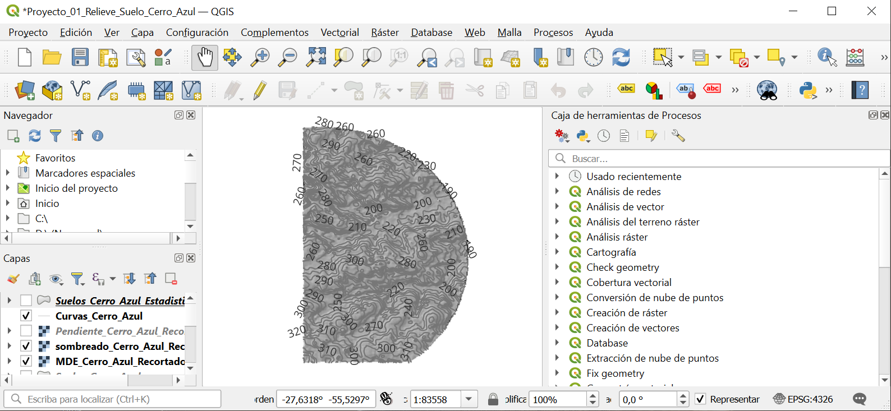

# Análisis del relieve y suelos de Cerro Azul, Misiones

## Descripción

Proyecto de Sistemas de Información Geográfica (SIG) orientado al análisis espacial del relieve y de las unidades de suelo de un área de 5 km alrededor de la localidad de Cerro Azul, Misiones, Argentina.

El proyecto integra datos raster y vectoriales provenientes de fuentes oficiales y utiliza QGIS para realizar el procesamiento, análisis espacial y elaboración de cartografía temática.

## Objetivo

Analizar las características del relieve y su relación espacial con las unidades de suelo mediante herramientas SIG.

El proyecto busca demostrar un flujo de trabajo completo que incluya preparación de datos, reproyección, análisis raster, procesamiento vectorial, estadísticas zonales y elaboración cartográfica.

## Datos utilizados

### Modelo Digital de Elevación

**Fuente:** Instituto Geográfico Nacional (IGN).

* MDE de 30 m.
* Departamento Leandro N. Alem, Misiones.
* Datos raster.
* Sistema de referencia original: EPSG:4326.

### Suelos

**Fuente:** Instituto Nacional de Tecnología Agropecuaria (INTA) – EEA Cerro Azul.

* Mapa de Suelos del departamento Leandro N. Alem.
* Escala 1:50.000.
* Datos vectoriales.
* Geometría de polígonos.

### Localidades

**Fuente:** Instituto Geográfico Nacional (IGN).

Se utilizó la capa oficial de localidades para localizar Cerro Azul y definir el área de análisis.

## Metodología

El flujo de trabajo realizado fue:

1. Descarga de datos oficiales del IGN e INTA.
2. Integración de las teselas del MDE mediante un VRT.
3. Identificación de la localidad de Cerro Azul.
4. Generación de un área de influencia de 5 km.
5. Recorte del MDE al área de estudio.
6. Reproyección del MDE a WGS 84 / UTM zona 20S (EPSG:32720).
7. Generación de pendiente.
8. Generación de aspecto.
9. Generación de sombreado del relieve.
10. Generación de curvas de nivel cada 10 m.
11. Recorte de las unidades de suelo.
12. Aplicación de estadísticas zonales sobre la pendiente.
13. Clasificación y representación cartográfica.
14. Elaboración del mapa final.
15. Exportación del resultado a PDF.

## Análisis de resultados

Los valores de pendiente media obtenidos en los polígonos con estadísticas válidas se encuentran aproximadamente entre 4,3° y 7,2°.

El valor máximo de pendiente registrado en uno de los polígonos alcanzó aproximadamente 28,2°, mostrando que dentro de algunas unidades de suelo existen sectores con pendientes considerablemente superiores a la pendiente media.

La unidad CAz1 presentó una pendiente media aproximada de 7,2°, mientras que Fra4 presentó aproximadamente 4,3°.

Los valores nulos de algunas unidades fueron conservados como datos sin estadística zonal disponible y no fueron interpretados como pendientes de 0°.

## Capturas del proceso

### 1. Relieve, sombreado y curvas de nivel

### 2. Pendiente y suelos

### 3. Estadísticas zonales

## Productos generados

* Modelo Digital de Elevación recortado y reproyectado.
* Raster de pendiente.
* Raster de aspecto.
* Raster de sombreado.
* Curvas de nivel.
* Capa de suelos recortada.
* Capa de suelos con estadísticas zonales.
* Mapa temático final.
* Informe técnico.

## Software

**QGIS 3.44.13 – Solothurn**

Se utilizaron herramientas de procesamiento raster y vectorial, incluyendo GDAL.

## Sistema de referencia

**WGS 84 / UTM zona 20S – EPSG:32720**

## Fuentes

* Instituto Geográfico Nacional (IGN).
* Instituto Nacional de Tecnología Agropecuaria (INTA) – EEA Cerro Azul.

## Uso de inteligencia artificial

Durante el desarrollo del proyecto se utilizó inteligencia artificial como herramienta de apoyo para el aprendizaje, consulta de procedimientos, resolución de dudas técnicas y organización de la documentación.

Los datos utilizados provienen de fuentes oficiales. El procesamiento y la elaboración de los productos cartográficos fueron realizados y verificados en QGIS.

## Autor

**Héctor Acuña**

Estudiante de Tecnicatura Universitaria en Sistemas de Información Geográfica y Teledetección.

**Septiembre de 2026**
