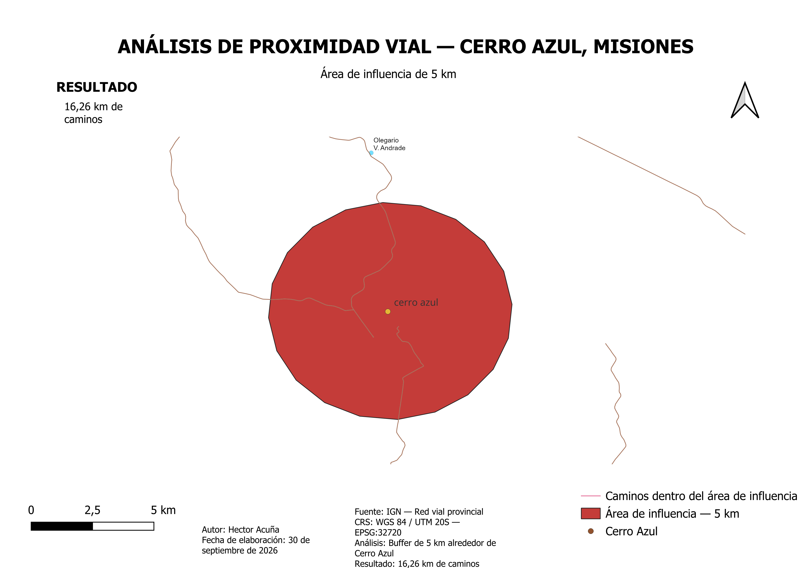

# Práctica 2 — Análisis vectorial de proximidad alrededor de Cerro Azul

## Objetivo

Determinar y representar la cantidad de infraestructura vial ubicada dentro de un radio de 5 km alrededor de Cerro Azul, Misiones, mediante herramientas de análisis vectorial en QGIS.

## Datos utilizados

* Cerro Azul: ubicación obtenida a partir de datos oficiales del Instituto Geográfico Nacional (IGN).
* Red vial provincial: datos oficiales del IGN.
* Sistema de referencia: WGS 84 / UTM zona 20S — EPSG:32720.

## Metodología

1. Se definió la ubicación de Cerro Azul mediante sus coordenadas geográficas.
2. Se reproyectó el punto al sistema de coordenadas UTM 20S.
3. Se generó un buffer de 5 km alrededor de la localidad.
4. Se recortó la red vial provincial utilizando el área de influencia.
5. Se calculó la longitud de cada tramo vial.
6. Se obtuvo la longitud total de caminos dentro del área analizada.
7. Se representaron los resultados mediante una composición cartográfica.

## Resultado

El análisis identificó aproximadamente:

**16,26 km de caminos dentro de un radio de 5 km alrededor de Cerro Azul.**

## Herramientas y conocimientos aplicados

* QGIS
* Datos vectoriales
* Sistemas de coordenadas
* Reproyección cartográfica
* Análisis de proximidad
* Buffer
* Recorte de capas vectoriales
* Cálculo de longitudes
* Expresiones de QGIS
* Funciones de agregación
* Diseño cartográfico

## Producto cartográfico

## Fuente

**Instituto Geográfico Nacional (IGN) — Argentina**

## Software

**QGIS 3.44.13**

## Autor

**Héctor Acuña**

**Fecha:** septiembre de 2026
